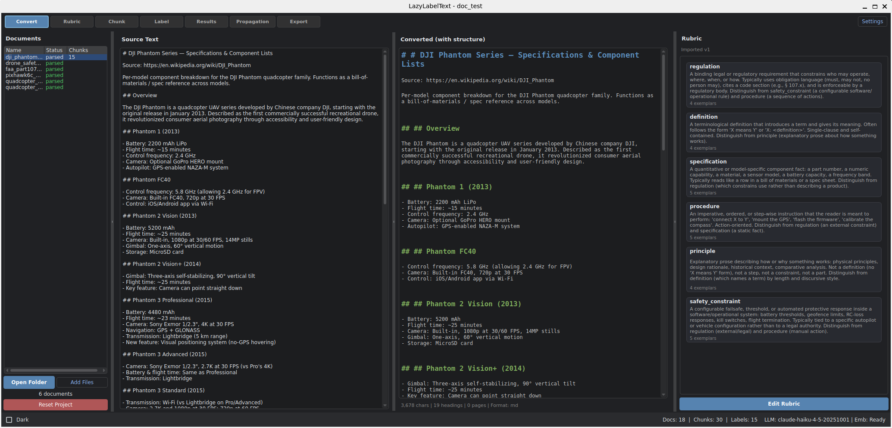
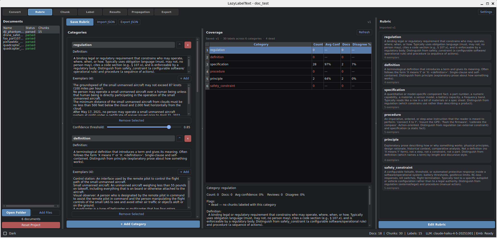
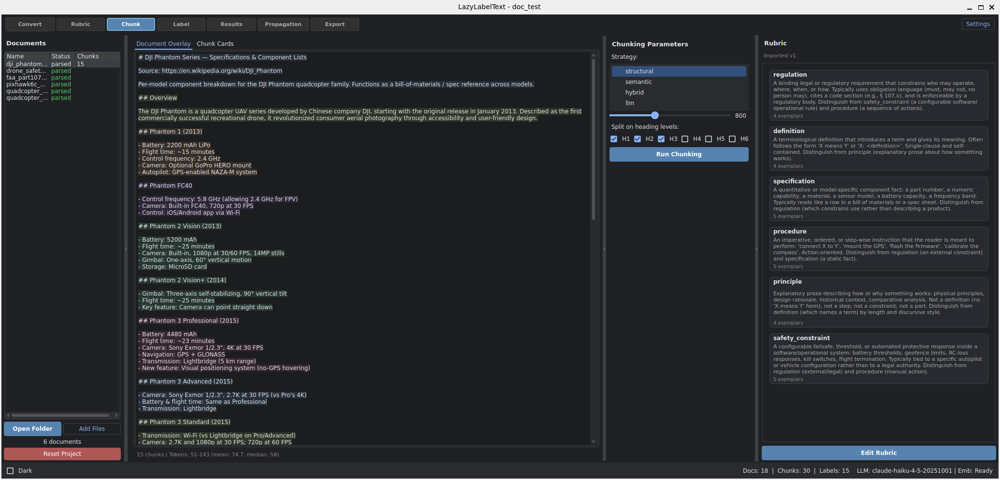
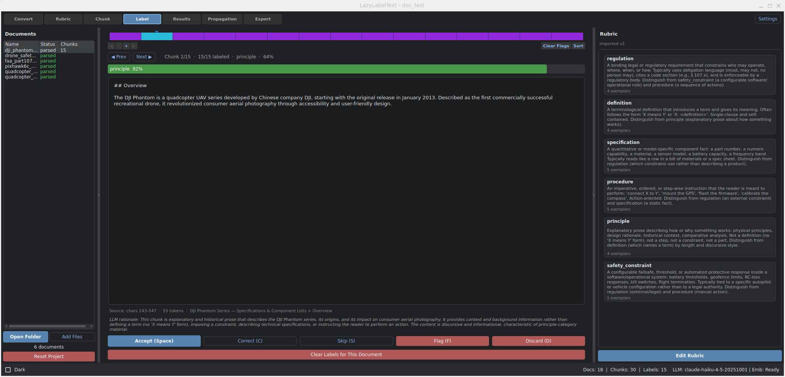
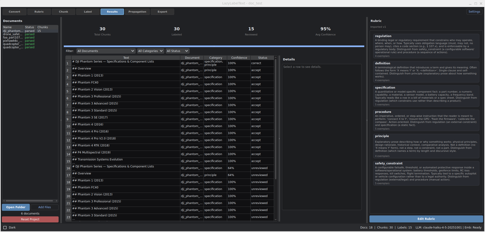
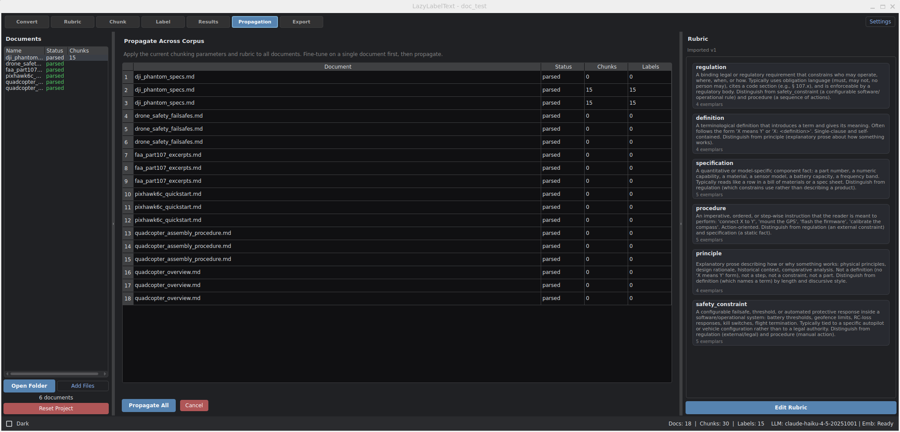
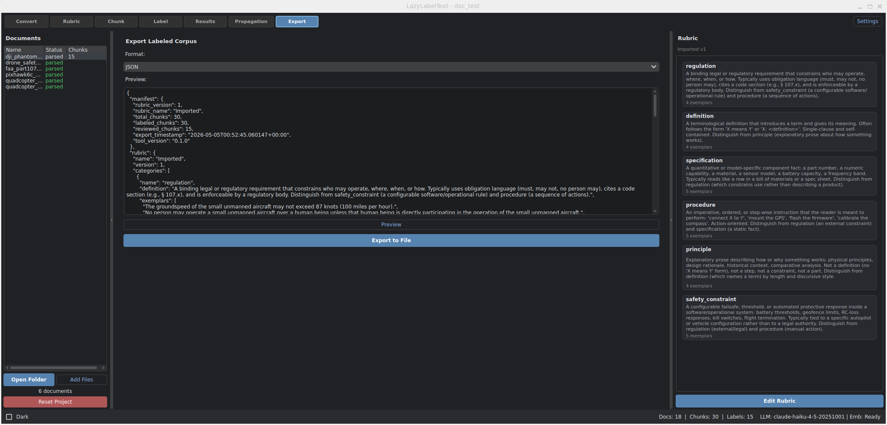

# LazyLabelText

[](https://github.com/dnzckn/LazyLabelText/blob/main/LICENSE)

LazyLabelText is a focused desktop tool for producing high-quality labeled text corpora from document collections. Sister project to [LazyLabel](https://github.com/dnzckn/LazyLabel) (image segmentation labeling) — same philosophy, different modality.

It takes a folder of source documents (PDF, Word, Markdown, plain text), helps a human + LLM team chunk them, label them against a structured rubric, and export the result as a labeled corpus ready to feed downstream systems: consolidation pipelines, RAG indexes, training data, knowledge graphs, audit corpora.

The tool's job ends at "labeled corpus." It does not consolidate, synthesize, or generate — those are downstream concerns and belong in separate tools.

---

## Get Started

**Full install (with LLM labeling and local embeddings):**
```bash
pip install -e ".[include-ai]"
llt
```

**Core install (no PyTorch / no LLM labeling):**
```bash
pip install -e .
llt
```

**From source:**
```bash
git clone https://github.com/dnzckn/LazyLabelText.git
cd LazyLabelText
pip install -e ".[include-ai]"
llt
```

**Requirements:** Python 3.10+. Full install pulls down sentence-transformers (~90 MB embedding model on first run) and the Anthropic SDK. Set `ANTHROPIC_API_KEY` in your environment, or configure it in Provider Settings inside the app.

---

## Core Principles

1. **Rubric is the artifact.** Categories, definitions, exemplars, and boundary cases are first-class versioned data — saved with every label and queryable downstream.
2. **Chunking is tunable and inspectable.** Pick a strategy (structural / semantic / hybrid / LLM), tune thresholds, see the chunks, re-chunk without leaving the page.
3. **Humans confirm, LLM proposes.** Claude predicts; the human accepts, corrects, skips, flags, or discards. Every disagreement is captured.
4. **Provenance is non-negotiable.** Every chunk carries source doc, char offsets, section path. Every label change is logged with timestamp and actor.
5. **Local-first.** Documents never leave your machine. LLM calls are pluggable (Anthropic today; OpenAI / Ollama hooks reserved). Embeddings run locally via sentence-transformers.

---

## Chunking Strategies

| Strategy | When to use | Cost |
|---|---|---|
| **structural** | Default. Splits on headings + paragraphs, enforces token bounds. | free |
| **semantic** | Unstructured prose with topic shifts. Embeds each sentence, splits where cosine similarity drops. | one local embedding pass |
| **hybrid** | General purpose. Structural pass first; semantic on oversized chunks. | embeddings on residuals only |
| **llm** | Tabular / list-heavy / atomic-fact extraction. Sends each window to Claude for atomic-clause splits. | one Anthropic call per ~3000-token window |

All strategies are picked from the dropdown in the Chunk tab. Re-running chunking on a document **replaces** prior chunks and labels for that document.

---

## Export

The labeled corpus exports as JSON (JSONL/Parquet/CSV planned). Each chunk record carries:

- `text`, `source` (filename, char_start, char_end, section_path), `token_count`
- `chunk_type`, `boundary_confidence`, `manual_override`
- `label.rubric_version`, `label.categories`, `label.confidence`, `label.composite_confidence`, `label.knn_agreement`, `label.rationale`, `label.llm_model`
- `label.human_review` (when reviewed): `action`, `final_categories`, `reviewer`, `notes`, `reviewed_at`

The export bundle includes a manifest with corpus statistics, the rubric used, and tool version, so downstream consumers can reproduce or audit.

---

## Documentation

- [Project idea & design notes](LazyLabelText_idea.md) — phased roadmap, data model, open questions
- [GitHub Issues](https://github.com/dnzckn/LazyLabelText/issues) — bug reports / feature requests

---

## Tab Walkthrough

The application is organized as seven tabs across the top of the main window. Switch between them with the toolbar buttons or the **F1–F7** hotkeys. Each tab corresponds to one stage of the labeling workflow.

### Convert (F1)



Loads documents from a folder, identifies their format (PDF, DOCX, HTML, Markdown, plain text), and converts each to an internal representation that preserves heading hierarchy, page or section boundaries, and original character offsets for citation. The left panel shows each document's parse status; the center pane shows source vs. converted text side-by-side so you can verify the conversion before committing to it.

### Rubric (F2)



Structured editor for the labeling rubric — categories, definitions, exemplars, boundary cases, and confidence thresholds. Each saved edit creates a new rubric version, so old labels stay tagged with the version that produced them. The right pane shows a **corpus coverage map** for the active rubric: per-category counts, average confidence, document spread, and the human-disagreement rate. It flags categories that are dead (zero usage), low-confidence (LLM consistently uncertain), or high-disagreement (humans keep correcting them) so you know which definitions need work.

### Chunk (F3)



Picks a chunking strategy (structural / semantic / hybrid / LLM) and tunes its parameters: min/max tokens, heading levels, similarity threshold for the embedding-based strategies. The center pane shows the resulting chunks as cards or as an inline overlay on the source text. The strategy combo and parameter sliders update live; clicking **Run Chunking** commits the new chunks for that document and clears any previous labels (since they were labeled against a different chunking).

### Label (F4)



Per-document chunk review with a **timeline visualization** at the top: one cell per chunk, color-coded by predicted category, with a blue marker on the current chunk. Click any cell to jump there; **Prev / Next** buttons or **Left / Right arrows** step through. The center shows the current chunk's text, the LLM's predicted label and confidence, the rationale, and source citation. Action buttons commit a human review: **Accept** (keep as predicted), **Correct** (multi-select picker for the right categories), **Skip**, **Flag**, or **Discard** (delete the label so the chunk re-enters the unlabeled pool). **Run LLM Labeling** batch-labels every unlabeled chunk in the current document; a background worker keeps the UI responsive and the timeline updates as each chunk lands.

### Results (F5)



Tabular browser of every labeled chunk in the project. The dashboard at the top shows total chunks, labeled count, reviewed count, and average confidence. The table is filterable by document, category, and review status, with a detail panel on the side that shows the chunk text, confidence bars, and rationale for any selected row. Manual reviews surface as 100% confidence with the human-corrected categories — provenance is preserved by the underlying schema (the LLM's original prediction is kept in `human_review` block of the export).

### Propagation (F6)



Once you've tuned chunking parameters and the rubric on a single document, propagation applies the same configuration across **every** document in the project. The status table shows per-document chunk and label counts; **Propagate All** kicks off a background worker that chunks and labels each remaining document in order, with a cancel button. Use this only after the rubric is settled — re-running propagation replaces prior chunks and labels.

### Export (F7)



Exports the labeled corpus to a downstream-ready format. Pick a format (JSON today; JSONL / Parquet / CSV / custom Python planned), preview the output, and save. The export bundle includes the rubric version that produced the labels and a manifest with corpus statistics, so downstream consumers can audit or reproduce. Each chunk record is self-describing — it carries its rubric version inline, so a JSONL stream stays meaningful even when read line-by-line.

---
