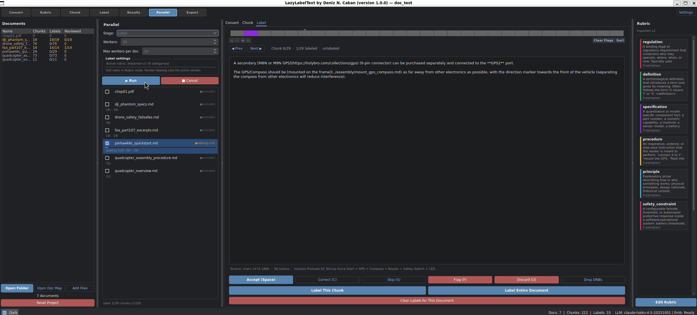

# LazyLabelText

[](https://github.com/dnzckn/LazyLabelText/blob/main/LICENSE)

LazyLabelText is a desktop tool for zero-shot chunk classification with LLMs. It takes a folder (or doc map) of source documents, chunks them with a strategy you control, has an LLM propose labels against a structured rubric, and exports a labeled corpus ready for downstream pipelines (RAG, training data, audit). The tool's job ends at "labeled corpus" — it does not consolidate, synthesize, or generate.



---

## Get Started

**Install** (everything in one shot — LLM providers, local embeddings, high-fidelity conversion):
```bash
pip install -e .
llt
```

**From source:**
```bash
git clone https://github.com/dnzckn/LazyLabelText.git
cd LazyLabelText
pip install -e .
llt
```

**Requirements:** Python 3.10+. Configure LLM/embedding providers via Provider Settings inside the app or via environment variables.

### Supported Providers

| Type | Provider | Env var | Notes |
|---|---|---|---|
| LLM | Anthropic (Claude) | `ANTHROPIC_API_KEY` | hosted |
| LLM | OpenAI (GPT) | `OPENAI_API_KEY` | hosted |
| LLM | Google (Gemini) | `GOOGLE_API_KEY` | hosted |
| LLM | Azure OpenAI | env-driven | hosted; corporate-friendly |
| LLM | Ollama (Llama / Mistral / Gemma / Qwen / …) | — | local; needs an Ollama server, configure base URL in-app |
| Embedding | sentence-transformers | — | local; ~90 MB model downloaded on first use |
| Embedding | OpenAI / Azure embeddings | shared with LLM env vars | hosted |

Switching providers mid-project is safe — existing labels stay tagged with the model that produced them.

---

## Ingestion

Two ways to bring documents into a project — pick whichever fits how your data is laid out on disk.

### Open Folder

Point the app at a directory; it walks recursively for `.pdf` / `.docx` / `.md` / `.markdown` / `.txt`. The project database lives at `<folder>/project.db`.

### Open Doc Map

Provide a small text file (gitignore syntax, but include-by-default) listing paths and globs from anywhere on disk. Source documents stay where they are; you pick a separate output directory for `project.db`. Useful when your corpus is scattered (`~/Papers`, `~/Notes`, `~/Work/Contracts`, …) and you don't want to copy or symlink it into one place.

```text
# my-corpus.docmap
~/Papers/2024/**/*.pdf
~/Notes/**/*.md
./local-handouts/*.docx

# Excludes (override matching includes)
!~/Papers/**/draft/**
```

`~`, `$VAR`, and relative paths (resolved from the docmap file's directory) all work. See [`docs/example.docmap`](docs/example.docmap) for a copy-paste starting point.

### Document Identity

Documents are deduped by **SHA256 of source bytes**, not filename. Same content moved to a new path → silently merged (chunks/labels preserved). Same basename, different content → loaded as separate rows.

---

## Workflow

The app is organized as a sequence of stages — toolbar buttons or **F1–F7** hotkeys.

| Stage | Hotkey | What it does |
|---|---|---|
| **Convert** | F1 | Convert source files to internal representation. PyMuPDF by default, optional **docling** high-fidelity for tables/figures, optional OCR for scanned PDFs. |
| **Rubric** | F2 | Versioned editor for categories, definitions, exemplars, boundary cases, confidence thresholds. Coverage map flags dead / low-confidence / high-disagreement categories. |
| **Chunk** | F3 | Pick a strategy (structural / semantic / hybrid / LLM), tune thresholds, see chunks live, re-chunk in place. |
| **Label** | F4 | Per-document review with a timeline visualization. Accept (Space) / Correct (C) / Skip (S) / Flag (F) / Discard (D) / Drop DNBs. |
| **Results** | F5 | Tabular browser of every labeled chunk; filter by document, category, review status. |
| **Parallel** | F6 | Corpus-wide stage runner — convert / chunk / label / edit / bypass-approval across all docs. Per-doc collaborators, drill-in to any doc, live progress. |
| **Export** | F7 | Export the labeled corpus to JSON + sidecar Parquet for embeddings. |

---

## Chunking Strategies

| Strategy | When to use | Cost |
|---|---|---|
| **structural** | Default. Splits on headings + paragraphs, enforces token bounds. | free |
| **semantic** | Unstructured prose with topic shifts. Embeds each sentence, splits where cosine similarity drops. | one local embedding pass |
| **hybrid** | General purpose. Structural pass first; semantic on oversized chunks. | embeddings on residuals only |
| **llm** | Tabular / list-heavy / atomic-fact extraction. Sends each window to the LLM for atomic-clause splits. | one LLM call per ~3000-token window |

Re-running chunking on a document **replaces** prior chunks and labels for that document.

---

## Parallel Mode

Run the same stage across the whole corpus at once with a tunable scheduler:

- **Workers** — total worker threads in the pool.
- **Max workers per doc** — caps how many workers can label chunks of the same doc concurrently. `1` = one doc finishes at a time (good for reviewer ergonomics); `= Workers` = all workers focus on a single doc; in between = hybrid.
- **Drill-in** — click any doc in the strip to view its converted text, chunks, or labels live. The right-side rubric panel is available the same way it is in plain Label mode.
- **Bulk operations** — the **Edit** stage drops all DNB labels across the corpus (e.g. after expanding the rubric). The **Bypass approval** stage marks every unreviewed label as `bypassed` (distinct from `accepted` so downstream consumers can tell deliberate human approvals from bulk pass-throughs).
- **DNB labels** — when the LLM judges a chunk doesn't fit any rubric category, the chunk gets a "DNB (does not belong)" label rather than being silently left blank. Rendered distinctly on the timeline so reviewers can tell "rejected by LLM" from "never labeled."

Total parallelism (Workers × Max-per-doc) is bounded by your LLM provider's API rate limits. The app retries 429s with exponential backoff up to 8x.

---

## Export

The labeled corpus exports as **JSON** with a sidecar **Parquet** for chunk embeddings. Each chunk record carries:

- `text`, `source` (filename, char_start, char_end, section_path), `token_count`
- `chunk_type`, `boundary_confidence`, `manual_override`
- `label.rubric_version`, `label.categories`, `label.confidence`, `label.composite_confidence`, `label.knn_agreement`, `label.rationale`, `label.llm_model`
- `label.human_review` (when reviewed): `action` (accept / correct / skip / flag / bypassed), `final_categories`, `reviewer`, `notes`, `reviewed_at`

The export bundle includes a manifest with corpus statistics, the rubric version, and tool version so downstream consumers can audit or reproduce.

---

## Core Principles

1. **Rubric is the artifact.** Categories, definitions, exemplars, and boundary cases are first-class versioned data — saved with every label and queryable downstream.
2. **Chunking is tunable and inspectable.** Pick a strategy, tune thresholds, see the chunks, re-chunk without leaving the page.
3. **Humans confirm, LLM proposes.** The LLM predicts; the human accepts, corrects, skips, flags, discards, or bulk-bypasses. Every disagreement is captured.
4. **Provenance is non-negotiable.** Every chunk carries source doc, char offsets, section path, content hash. Every label change is logged with timestamp and actor.
5. **Local-first.** Source documents never leave your machine. Embeddings run locally via sentence-transformers. Only LLM classification calls go off-machine, and only by your choice of provider.

---

## Documentation

- [GitHub Issues](https://github.com/dnzckn/LazyLabelText/issues) — bug reports / feature requests
